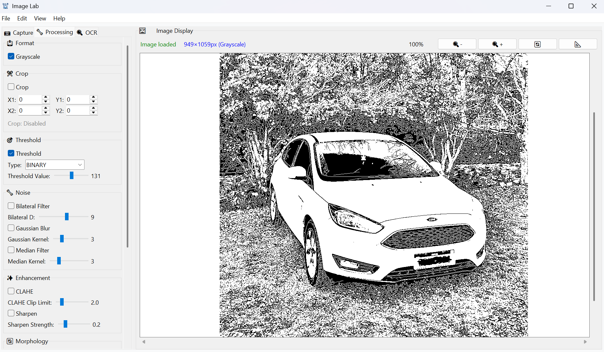

# 🖼️ Image Lab

A modular image processing toolkit with GUI for experimenting with computer vision algorithms and image manipulation techniques.

Image Lab serves as a flexible platform for testing and applying various image processing operations through an intuitive interface, designed for rapid prototyping and iterative development of image analysis workflows.

### Preview




## 🚀 Features

- **Modular Processing Pipeline**: Extensible architecture for adding new image processing operations
- **Real-time Preview**: Instant visual feedback for all applied transformations
- **Multiple Input Sources**: Load images from files, capture screenshots, or use camera devices
- **OCR Integration**: Built-in text recognition capabilities with configurable parameters
- **Configuration Management**: Save and load processing presets for reproducible workflows
- **Interactive Interface**: Tabbed GUI with organized controls for different operation categories

## 📋 Requirements

- **Python**: 3.13 or newer
- **Operating System**: Windows, macOS, Linux
- **Dependencies**: See `requirements.txt`. Note: `pytesseract` requires [Tesseract OCR](https://github.com/tesseract-ocr/tesseract) installed on your system.

## 📦 Installation

1. **Clone the repository**
   ```bash
   git clone https://github.com/kodezy/image-lab.git
   cd image-lab
   ```

2. **Create virtual environment**
   ```bash
   python -m venv venv
   
   # Windows
   venv\Scripts\activate
   
   # macOS/Linux
   source venv/bin/activate
   ```

3. **Install dependencies**
   ```bash
   pip install -r requirements.txt
   ```

4. **Run the application**
   ```bash
   python image_lab.py
   ```

## ⚙️ Configuration

The application uses JSON-based configuration files to store processing presets and settings. All configurations can be saved and loaded through the File menu, enabling reproducible workflows and easy sharing of processing pipelines.

## 🧪 Usage

1. **Load or Capture Image**: Import from file, capture screen, or use camera
2. **Apply Processing**: Configure operations through the tabbed interface
3. **Preview Results**: View real-time changes in the main display
4. **Run OCR** (optional): Extract text from processed images
5. **Save Results**: Export processed images or configuration presets

The modular design allows for easy experimentation with different processing combinations and parameter adjustments.

## 📁 Project Structure

```
image-lab/
├── src/                   # Source code
│   ├── core/              # Core processing modules
│   ├── gui/               # User interface components
│   ├── infra/             # Infrastructure layer
│   └── config.py          # Configuration classes
├── assets/                # Application resources
├── requirements.txt       # Python dependencies
└── image_lab.py           # Application entry point
```

## 📄 License

MIT License - see [LICENSE](LICENSE) file for details.
